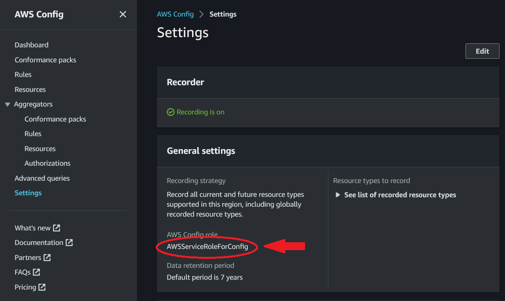

# Cost Optimization Conformance

This repository contains code to deploy the Cost Optimization Organization Conformance pack into an AWS Organization.

## Pre-requisites

In order to use this solution, the following components must be already deployed within an AWS account.

- AWS Organizations.
- AWS Config deployed in same region in all member accounts of the AWS Organization.
- Delegated AWS Config account within AWS Organizations.
- Delegated AWS CloudFormation Stackets account within AWS Organizations.

## Deployment Guide

Download `template.yaml` from the latest release.

Create a new CloudFormation stack this `template.yaml` file.

The parameters should be set as follows:

- **DeployingInDelegatedAdminAccount**: Set to `True` if you are deploying from a delegated Administrator account within your AWS Organization. Set to `False` if you are deploying from the AWS Organization Management Account.

  Information on AWS Account types within an AWS Organization can be found [here](https://docs.aws.amazon.com/organizations/latest/userguide/orgs_getting-started_concepts.html).

- **ConfigRoleExistingNamePattern**: The name pattern currently in use across the AWS Organization for the [Config Service Account Role](https://docs.aws.amazon.com/config/latest/developerguide/using-service-linked-roles.html). The field accepts `*` for wildcards. The Role name in each account can be found from the Config Settings area of the AWS Console (example shown in the image below).

  

  [!IMPORTANT]
  This setting is required to ensure the solution has the relevant permissions to be able to restore Config Settings to original values if you ever remove this solution from your Organization.

  [!WARNING]
  It is possible to set the value of this parameter to just `*` if you are not sure what naming convention you have already. However, this results in an IAM policy that breaks the principle of "least priviledge" so it is strongly advised to not do this.

## Post Deployment Configuration

This solution deploys some AWS Config Rules that have [Remediation](https://docs.aws.amazon.com/config/latest/developerguide/remediation.html) configured. These have all been deliberately setup up with only Manual Remediation. Linked accounts in the Organization can update this setting to make Remediation Automatic if desired.
