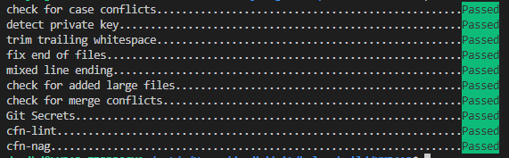

# Local Development

## Pre-Requisites

The following dependencies must be installed. Please refer to your operating system, how to install them.

> **Note:** For Windows, we recommend enabling Windows Subsystem for Linux (WSL) and installing Linux distribution of your choice,
> for example, here are the instructions on how to install [Ubuntu](https://ubuntu.com/tutorials/ubuntu-on-windows).

- Python ~= 3.9.0 and pip
- Ruby >=2.6 and gem
- [rain](https://github.com/aws-cloudformation/rain)
- [virtualenv](https://virtualenv.pypa.io/en/latest/installation.html) (optional)
- [pre-commit](https://pre-commit.com/#install)
- [cfn-lint](https://github.com/aws-cloudformation/cfn-lint)
- [cfn-nag](https://github.com/stelligent/cfn_nag)

## Build local development environment

Once you have installed pre-requisites, follow steps below.

### Install pre-commit hooks

```shell
pre-commit install
```

### Run pre-commit hooks against all files

```shell
pre-commit run --all-files
```



### Run `cfn-nag` against all CloudFormation templates

```shell
cfn_nag_scan --input-path .
```

## Build Template to test deployment

```shell
make build
make package
```

## Clear build files

```shell
make clean
```
